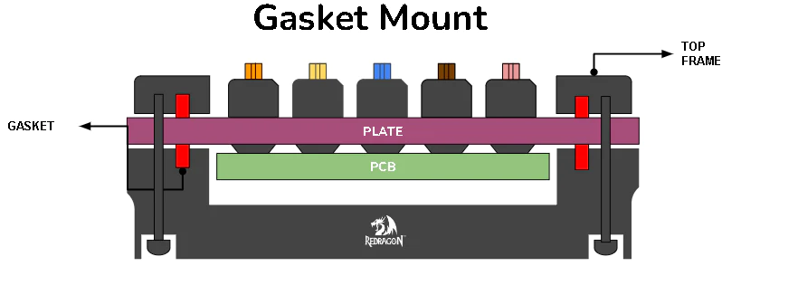
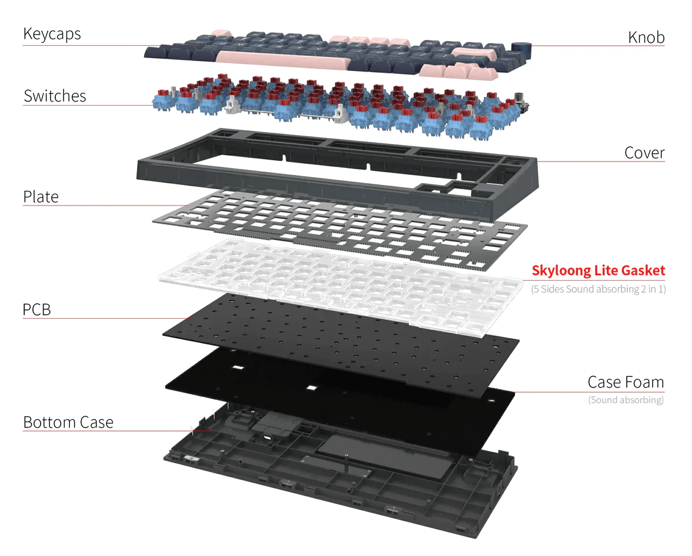
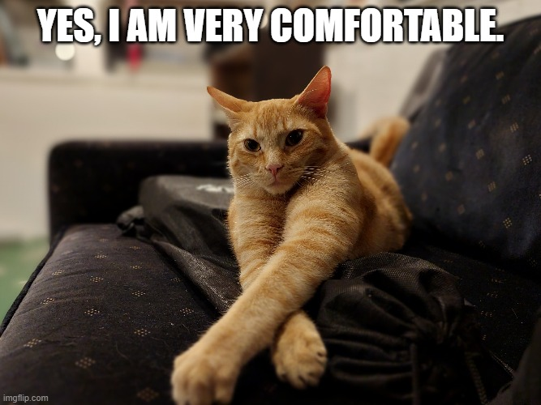
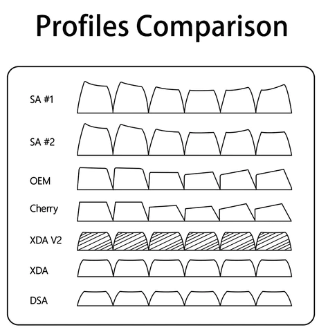
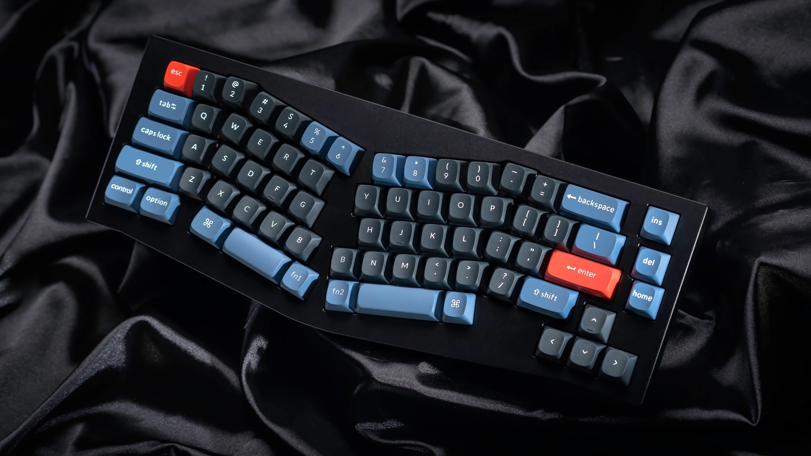
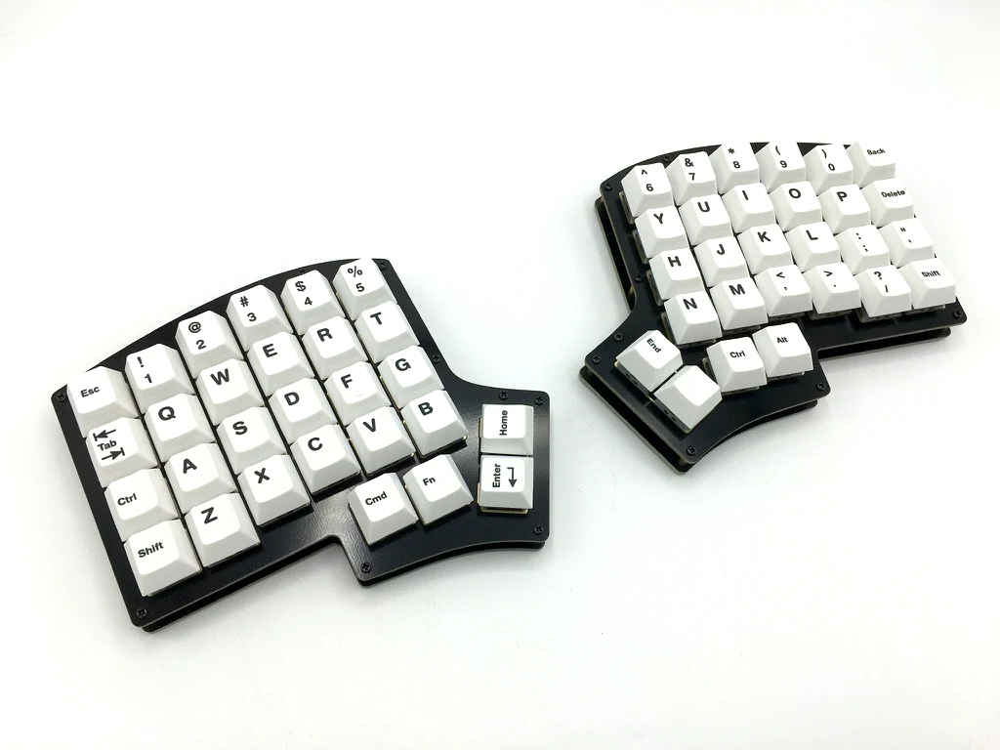
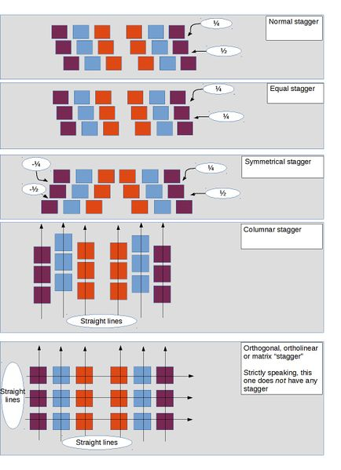
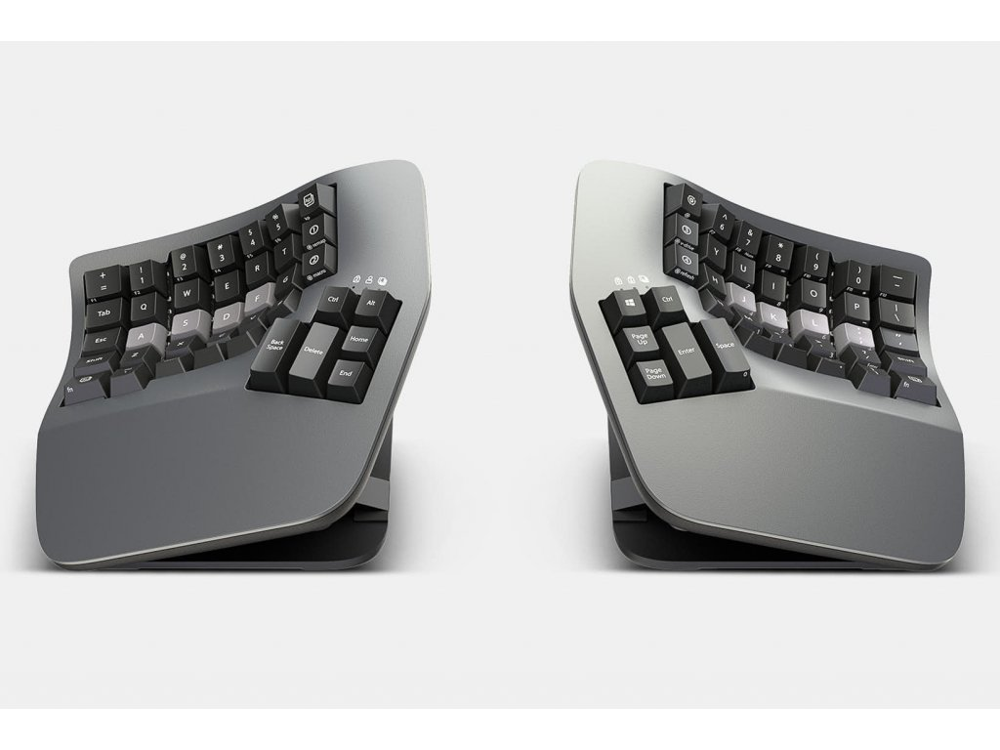
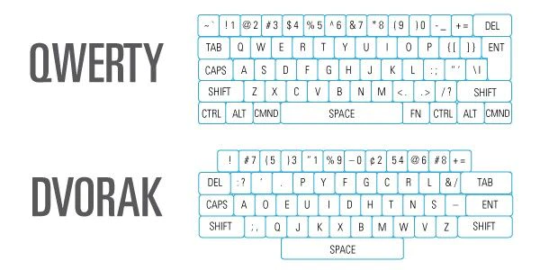
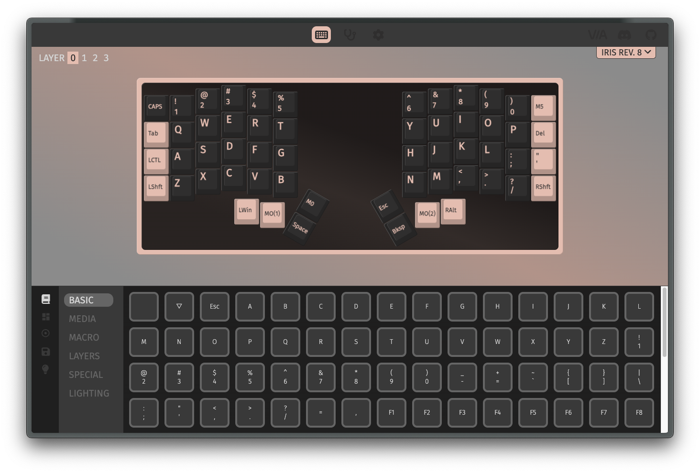

# Keyboards 101

From mechanicals to custom, and ergonomic ones
Daniel Lazar - One Identity

---

## What are mechanical keyboards?

===

### Compared to membrane keyboards

===

### Basic switch types

===

### The switch's colors

Different colors, represent:

- Different mechanisms
- Typing experiences
- Required weight to press

(These specs also depend on the switch's brand)

===

### E.g. Cherry MX switches specs

---

## Works differently... But why get one?

===

### Why?

- More convenient
- Sounds heavenly
- Can give more feedback
- Overall better typing experience

---

## How to have a good keyboard?

===

### Most important: Switches

- Choose the most convenient for you (linear, tactile, clicky)
- Have the right pressing weight
  - Heavier ones may be too much for you at first
- Is it pre-lubed?

===

### Wait you said lubed?

Yep

- Less spring noise
- Smoother presses

<!-- NOTE: You can do it yourself if you have unlubed switches (or you want to relube it), or buy pre-lubed ones that saves you lots of trouble. -->
<!-- TODO: Get some more usefull images -->

===

### And it's not just the switches

There are lots of factors, e.g.:

- Material of keycaps (e.g. PBT)
- Material of case
- Material of plate
- Gasket
- Foaming

===

===

---

## Increase the comfort of typing

===

### Keycap profiles

===

### Split keyboards

E.g. Alice style

===

### Fully split keyboards

===

### Staggers

===

### AND THERE IS EVEN MORE!

===

### Staggering in 3D

E.g. Kinesis keyboards

---

## Custom layouts and layers

===

### Layouts

- QUERTY
- QUERTZ
- COLEMAK
- DVORAK

===

### What are layers?

We use it everyday! E.g.:

- Standard layer
- Shift layer

But we can make custom ones!

===

### Programable keyboards

===

===

===

===

### My VIA demo

---

## Thank you!

===

### Summary

- What are mechanical keyboards?
- Works differently... But why get one?
- How to have a good keyboard?
- Increase the comfort of typing
- Custom layouts and layers

<u>Questions?</u>
