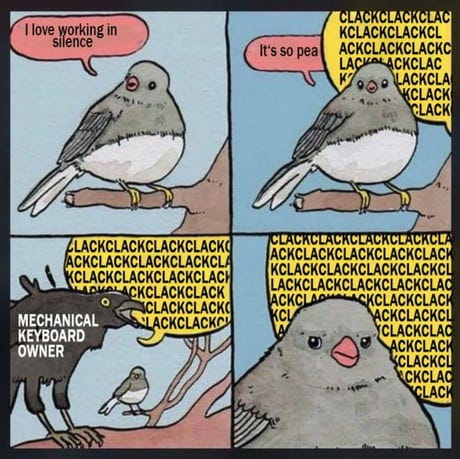
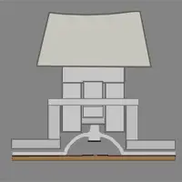
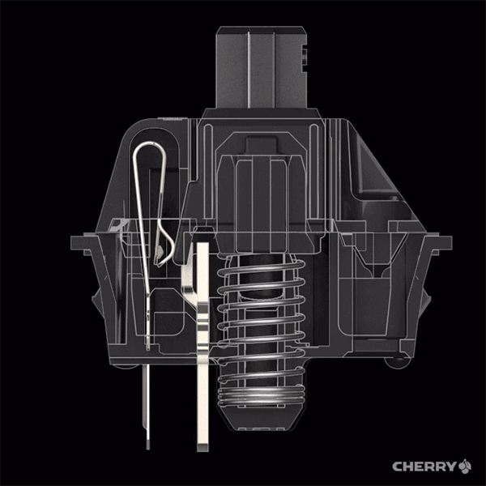
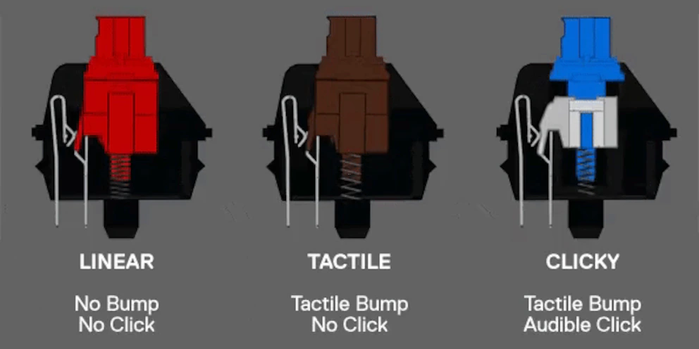
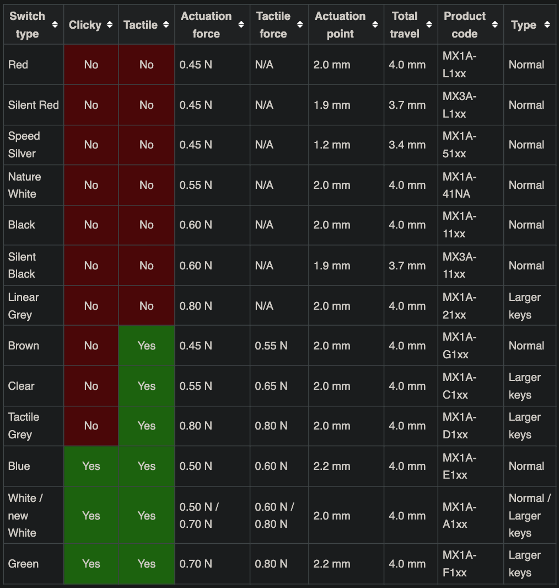
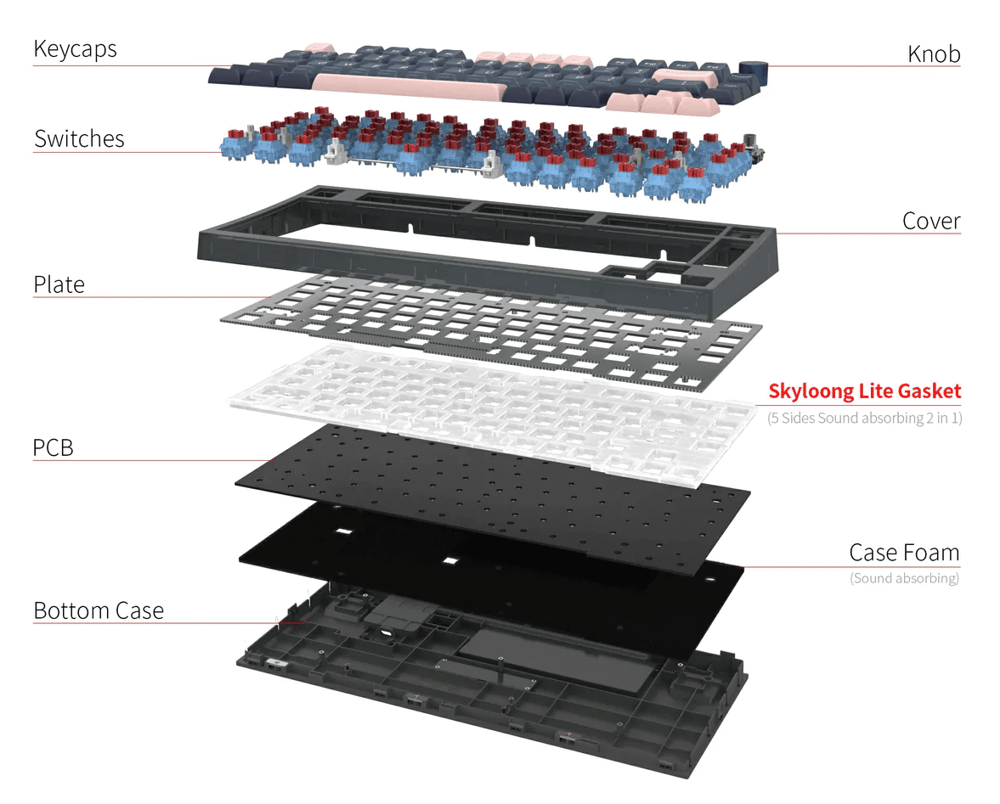

# Keyboards 101

From mechanicals to custom, and ergonomic ones
Daniel Lazar - One Identity

---

## What are mechanical keyboards?

===

### Compared to membrane keyboards

===

### Basic switch types

===

### The switch's colors

Different colors, represent:

- Different mechanisms
- Typing experiences
- Required weight to press

(These specs also depend on the switch's brand)

===

### E.g. Cherry MX switches specs

---

## Works differently... But why get one?

===

### Why?

- More convenient
- Sounds heavenly
- Can give more feedback
- Overall better typing experience

---

## How to have a good keyboard?

===

### Most important: Switches

- Choose the most convenient for you (linear, tactile, clicky)
- Have the right pressing weight
- Is it pre-lubed?

===

### Wait you said lubed?

Yep

- Less spring noise
- Smoother presses

<!-- NOTE: You can do it yourself if you have unlubed switches (or you want to relube it), or buy pre-lubed ones that saves you lots of trouble. -->
<!-- TODO: Get some more usefull images -->

===

### And it's not just the switches

There are lots of factors, e.g.:

- Material of keycaps
- Material of case
- Material of plate
- Gasket
- Foaming

===

